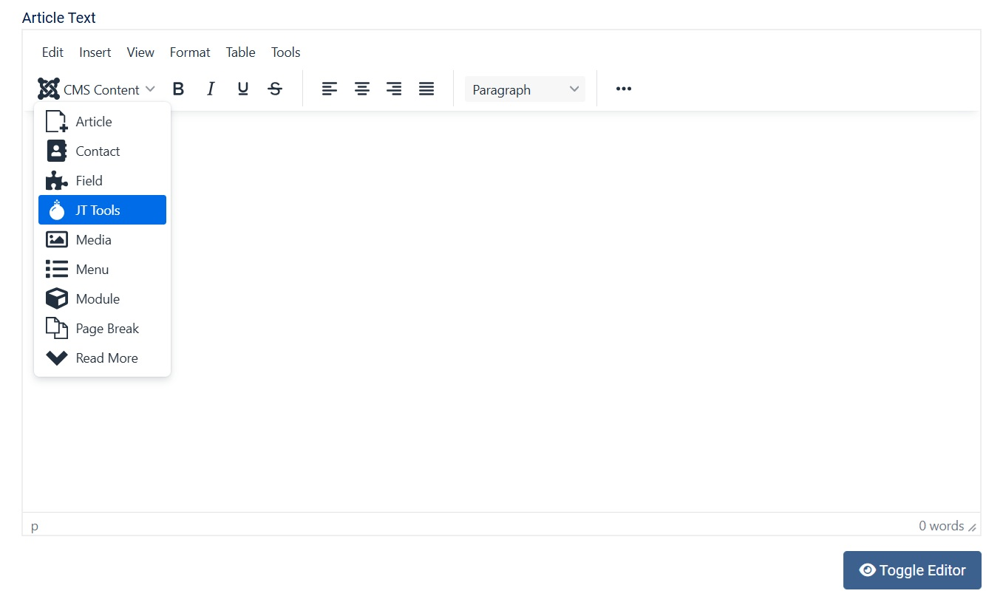
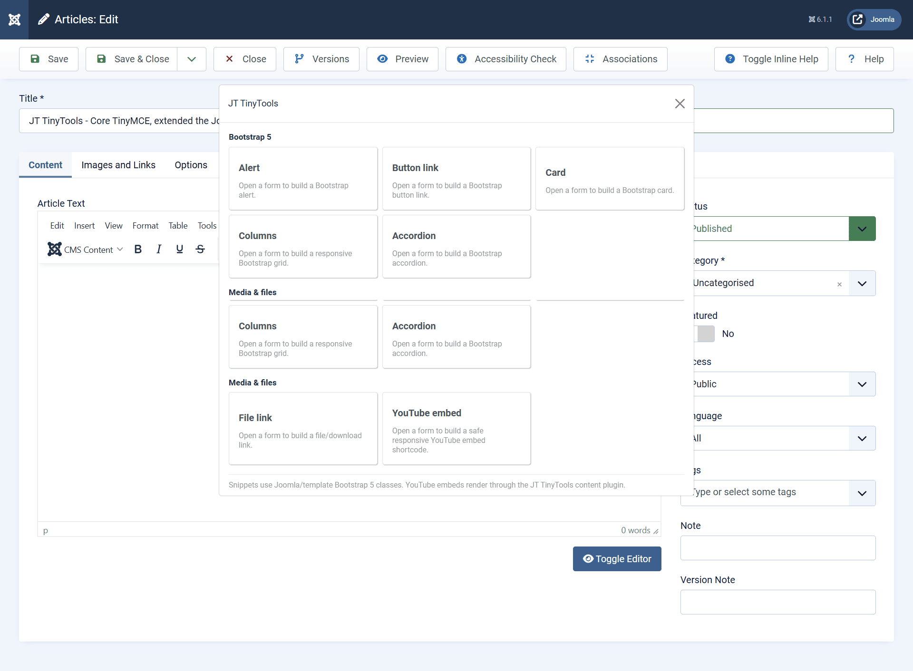
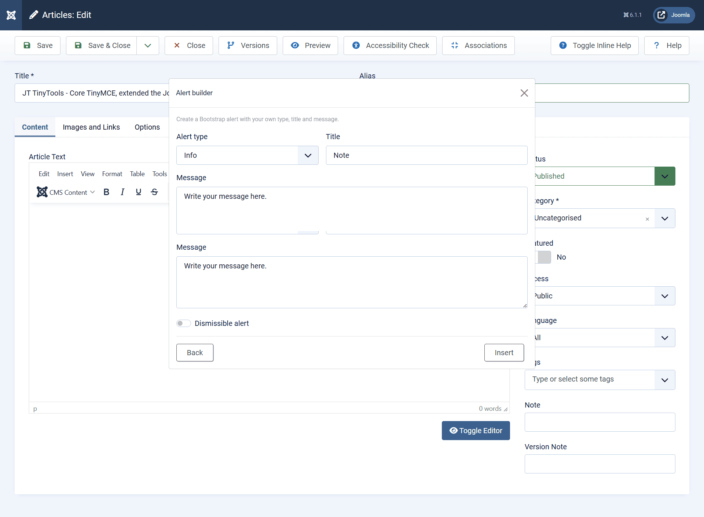
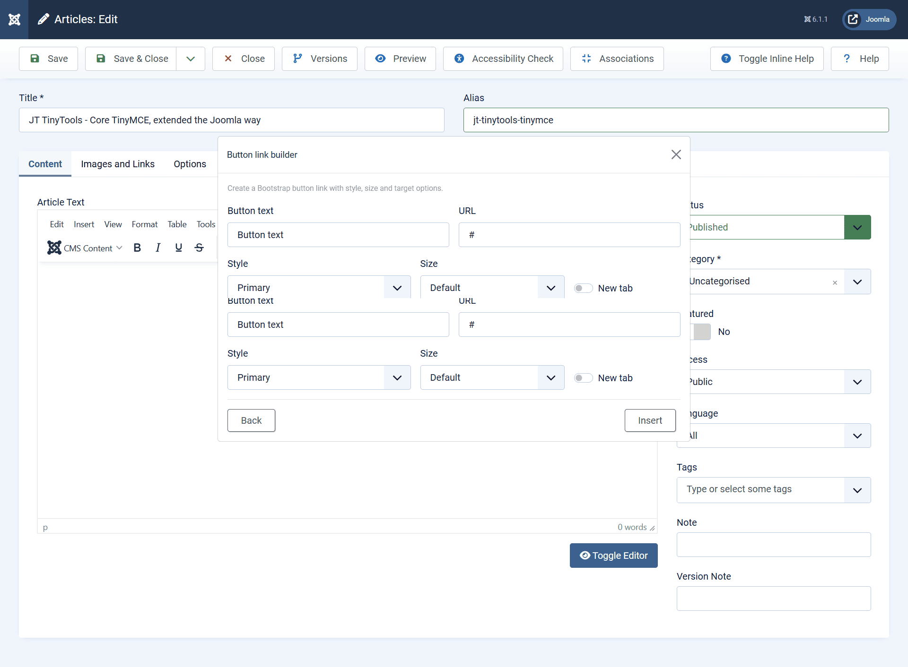
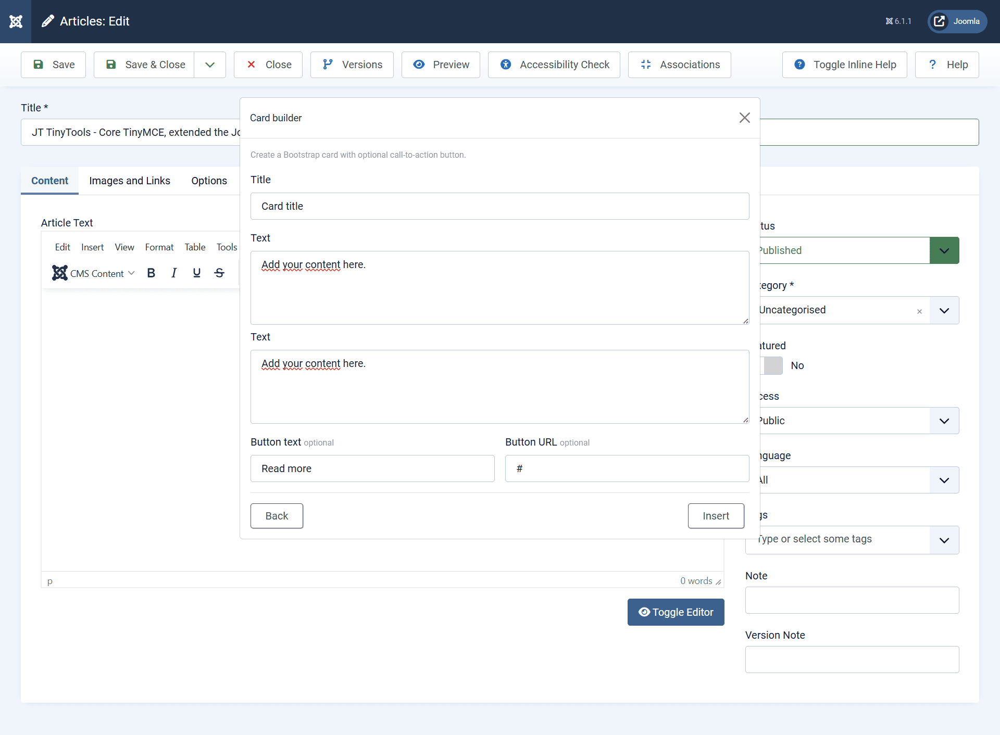
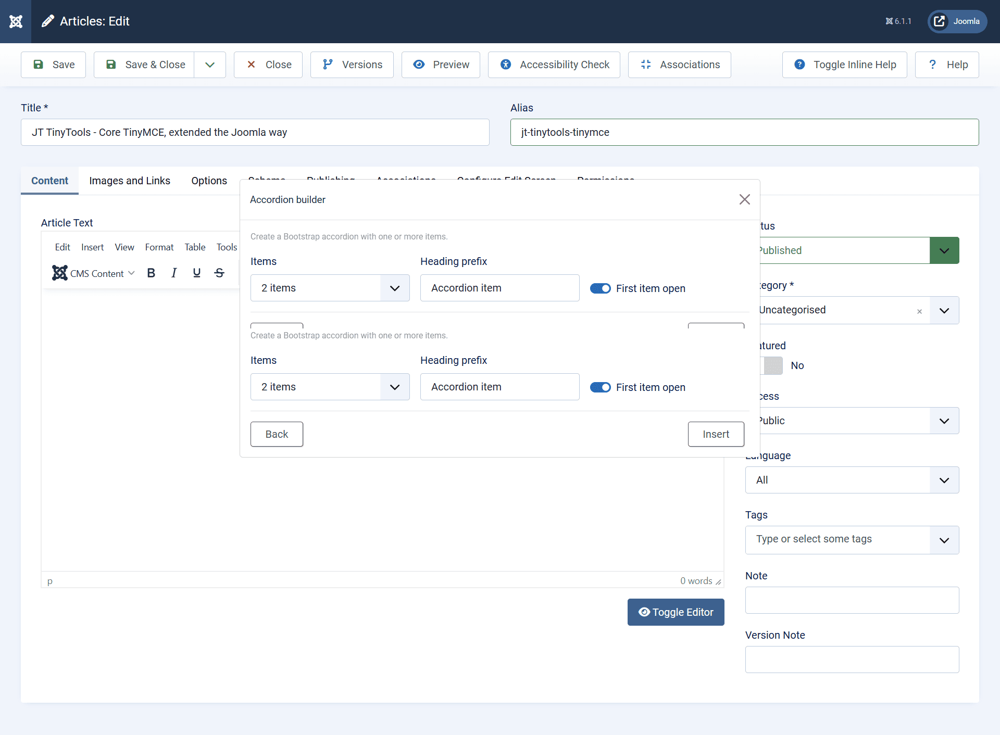
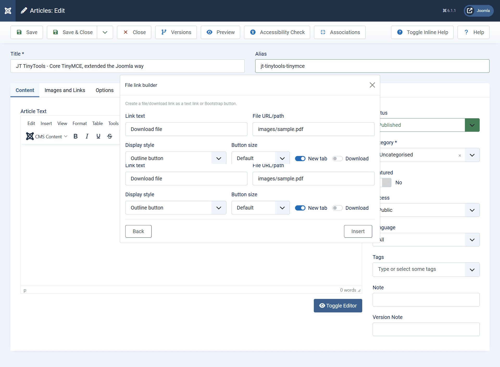
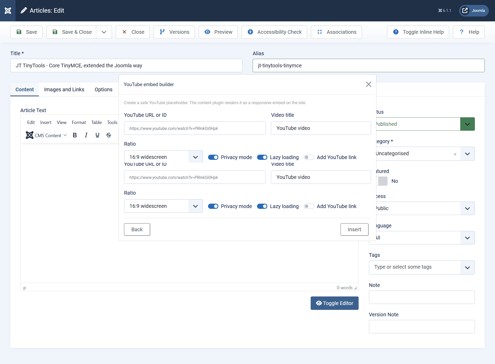
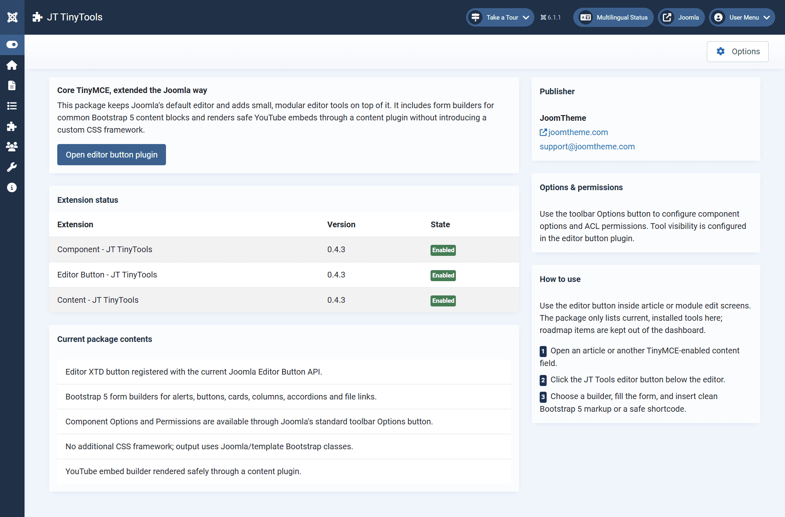

# JT TinyTools Demo

JT TinyTools extends Joomla's core TinyMCE editor with lightweight Bootstrap 5 content builders and privacy-friendly YouTube embeds.

This demo page shows the editor button workflow, available builders, and the administrator dashboard prepared for Joomla Extension Directory review.

## Demo environment

- Joomla 6.1.x
- Joomla core TinyMCE editor
- Bootstrap 5 classes from the active Joomla template
- JT TinyTools package 0.4.3+

## Editor button

JT TinyTools is available from the Joomla **CMS Content** editor button menu.

## Main tools modal

The **JT Tools** button opens a simple modal with Bootstrap 5 builders and media/file tools.

## Bootstrap 5 builders

### Alert builder

Create Bootstrap 5 alert blocks with type, title, message, and dismissible options.

### Button link builder

Create Bootstrap 5 button links with style, size, URL, and target options.

### Card builder

Create Bootstrap 5 card markup with title, text, and an optional call-to-action button.

### Columns builder

Create responsive Bootstrap grid layouts with configurable column count, breakpoint, gap, and heading level.

### Accordion builder

Create Bootstrap 5 accordion blocks with configurable item count and first-item-open behavior.

## Media and file tools

### File link builder

Create file or download links as plain links or Bootstrap button links.

### YouTube embed builder

Create safe YouTube embed shortcodes. The frontend output is rendered by the JT TinyTools content plugin, using privacy-friendly no-cookie embeds when enabled.

## Administrator component

The administrator component provides a compact dashboard with package status, extension versions, publisher information, options, and usage guidance.

## Notes for JED review

- JT TinyTools keeps Joomla's default TinyMCE editor workflow.
- It does not require JCE or any third-party editor.
- It does not load a custom CSS framework.
- Generated snippets use Bootstrap 5 classes available in Joomla templates.
- YouTube embeds are inserted as shortcodes to avoid editor/text-filter iframe removal issues.
- The content plugin renders YouTube shortcodes on the frontend.
